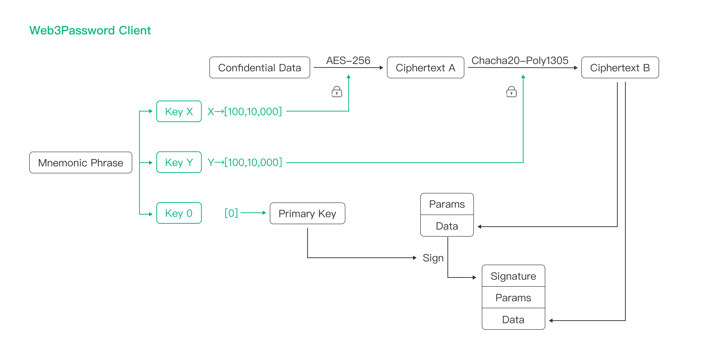
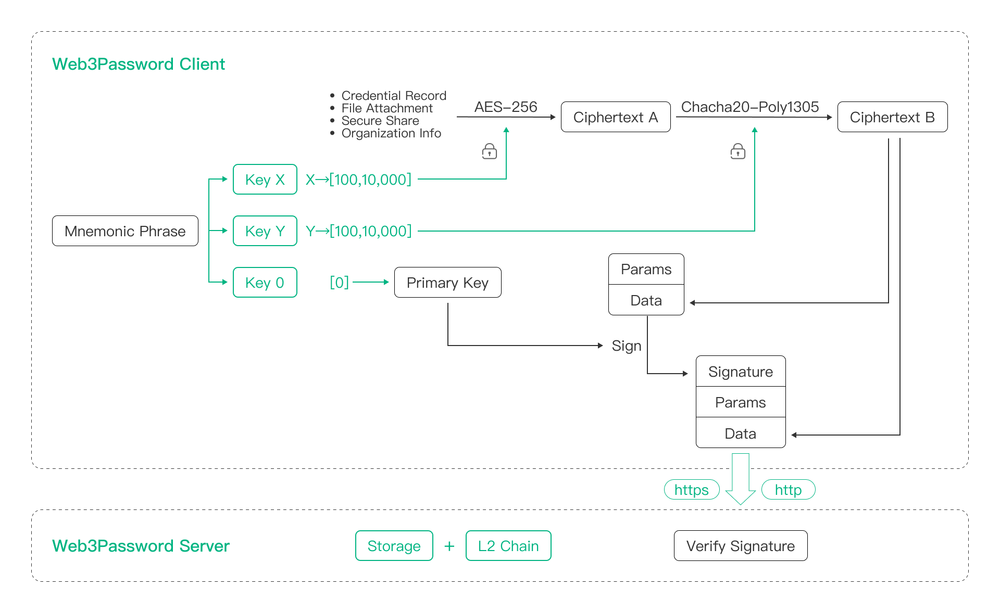
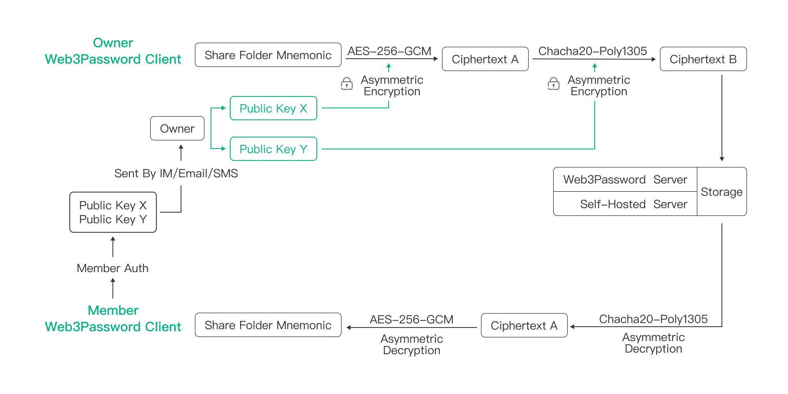

# Web3Password Security Whitepaper

## Origin

> In 2022, a password manager company was hacked, then many accounts are brute-foced, huge losses occurred. So key derivation from master password is not enough, there still have a huge security issue even if use PBKDF2 or Argon2. Because of this incident, Web3Password designed a Zero Trust Architecture("ZTA") that can be applied to password manager. Based on this ZTA, we have brought a revolutionary password manager - Web3Password.

> Currently, about $700 billion worth of cryptocurrency is secured by BIP39/BIP44 Mnemonic Phrase of Bitcoin. Mnemonic Phrase has been fully proven to be strong, safe and effective. Therefore, we have good reasons to believe that Web3Password, based on Mnemonic Phrase, could secure your data, could solve your security concerns and policy concerns about password manager.

## Account Security Principle of Web3Password

- Brand-new Passkey Account

> Web3Password innovatively introduces BIP39/BIP44 Mnemonic Phrase of Bitcoin into the Web3Password account system, and uses it to develop a passkey account system based on ECDSA. So Web3Password provides an account system endorsed by Bitcoin, which makes Web3Password's account system as secure as Bitcoin. The Mnemonic Phrase is only controlled by you, and only stored on your own device. Not even Web3Password can access it.

> Web3Password has completely abandoned insecure authentication such as Email, Username, SMS, OTP or 2-Factor. Insecure key derivation from Master Password also has been completely abandoned, and completely solved the account security issues caused by brute-force or engineering.

- Remove association between account and data security

> Based on our experience of security, Web3Password adopts an architecture that does not trust the server at all. It separates the account system and encryption keys, so there will no any associations between them in Web3Password. Therefore, even if all servers of Web3Password or all the equipments of Web3Password are completely controlled by hackers, there will no any security issues with your data.

## Data Security Principle of Web3Password

- Completely abandon Master Password

> In recent years, with the advancement of AI and the growth of GPU/ASIC computing power, the rounds of iterations for key derivation (PBKDF2/Argon2) have increased from 100,000 a few years ago to 600,000 or even 1 million, but we believe that the slow hash of key derivation from Master Password, simply by increasing the rounds of KDF (Key Derivation Function) or changing the KDF algorithm can not fundamentally guarantee the security of your data, because most Master Password are too weak, and based on the experience of many security incidents in history, Web3Password believes that in password manager, a core product, if it cannot provide future-proof security, it should be questioned. Based on this concept, in Web3Password, we have completely abandoned PBKDF2/Argon2 to derive keys from Master Password.

- Uses BIP39/BIP44 to encrypt data

> In blockchain represented by Bitcoin, most blockchain products have used Mnemonic Phrase as their account systems. Most blockchain users also use BIP39/BIP44 Mnemonic Phrase to protect their cryptocurrency. Based on our experience of blockchain, Web3Password innovatively introduces BIP39 private key to encrypt your data, therefore your data will be as secure as Bitcoin.

- Cross-encryption to avoid vulnerability

> From security incidents in history that many widely used infrastructures may have some security vulnerabilities that have been deliberately implanted. Therefore, many security experts and cryptographers are skeptical about the security of encryption algorithms. They also suspect that some governments and institutions will get involved in the design of algorithms and infrastructures, and then deliberately design some flaws or implants in the implementation of some algorithms or infrastructures. Based on these experience and lessons, and benefiting from Mnemonic Phrase, in order to make Web3Password achieve future-proof security, Web3Password believes that it is necessary to use different keys and different encryption algorithms to encrypt your data. To prevent possible algorithm security issues and ensure that Web3Password always has future-proof security. After evaluation by Web3Password engineering team, we have currently selected AES-256-GCM and Chacha20-Poly1305, two encryption algorithms that support 256-bit keys, which are widely recommended by the cryptography community for cross-encryption of your data. At the same time, relying on Web3Password's powerful engineering capabilities, we have reserved good scalability to ensure that Web3Password can introduce new security algorithms to encrypt your data when needed.

- Communication and storage security

> Web3Password only processes your plaintext data on your device. Before all data leaves your device, Web3Password use cross-encryption to ensure your data security, and use the ECDSA to sign your data to ensure data integrity. Because of the unpredictability of BIP39/BIP44 keys, Web3Password can do our best to ensure that security of your data will not be affected even if it is transmitted over an insecure network. We can also ensure that security of your data will not be affected even if it is stored in insecure servers. Based on this security principle, we will store your data(some users) in the blockchain by default to protect your ownership of data.

## Secure Share Principle of Web3Password

> In share center of Web3Password, you can create your own shared folder ("Share Folder") and invite any families, friends or collaborators to join your Share Folder, so that you can share your confidential data with them easily. The basic principle is that when each Share Folder is created, the device of the Share Folder creator("Owner") will generate a new Mnemonic Phrase("Share Folder Mnemonic"), and then uses the Owner's key to encrypt Share Folder Mnemonic and stores it in the server. When the Owner imports records to Share Folder, the records will be encrypted using multiple keys derived by Share Folder Mnemonic(Symmetric Encryption), and then stored in the server as mapping records. When the Owner add a new Member, the Share Folder Mnemonic will be encrypted by the Member's multiple public keys parsed from the Member Auth provided by the Member, and the ciphertext of Share Folder Mnemonic will be stored in the server, so that the server will establish a mapping relationship between Member and ciphertext of Share Folder Mnemonic. In this way, when the Member accesses the Share Folder, it can obtain the mapping relationship from the Share Folder, thus obtaining ciphertext of the Share Folder Mnemonic. Then the Member's private key can be used to decrypt the ciphertext of Share Folder Mnemonic on the devices, so that Member can easily get the plaintext of Share Folder Mnemonic on their devices, so the Member can easily decrypt the ciphertext of share record on their devices. Owner can revoke Member's access at any time.

## Transparent Protocol Principle of Web3Password

> Web3Password has fully considered your concerns about backdoors and other concerns, and hopes to resolve your concerns about backdoors through our efforts. Based on this consideration, relying on Web3Password's advanced account system and powerful data encryption system, a transparent protocol is designed to meet security requirements, protect your privacy, and facilitates third-party auditing.

> Web3Password has completely abandoned cookie and token, and instead used the ECDSA signature of Bitcoin to ensure the integrity and security of communication. This ensures that using Web3Password, even if you completely use HTTP communication, a third party cannot tamper with the your communication content at all. At the same time, relying on Web3Password's leading security confidence, even if a third party captures your communication content, it will not pose any security threat to your data. Based on this, Web3Password achieves the perfect integration of communication security and transparency. And relying on this, any third party can audit the communication content of Web3Password anytime and anywhere to ensure that Web3Password does not have any built-in backdoors.

> About Web3Password Transparent Protocol
> https://github.com/web3password/web3password-protocol

> Audit Transmission
> https://github.com/web3password

## Open Source of Web3Password
> https://github.com/web3password

## About BIP39/BIP44
> https://youtu.be/S9JGmA5_unY

> https://github.com/bitcoin/bips/blob/master/bip-0039.mediawiki

> https://github.com/bitcoin/bips/blob/master/bip-0044.mediawiki

## About Passkey
> https://www.youtube.com/watch?v=2xdV-xut7EQ

## Thanks
> We thank Bitcoin community, like Marek Palatinus, Pavol Rusnak, Aaron Voisine, Sean Bowe, these great algorithm engineers, security engineers and cryptography engineers for bringing us such a powerful technology as Mnemonic Phrase. Based on Mnemonic Phrase, we have the opportunity to bring the security of products like Web3Password to the top of human society. Hats off to them!

